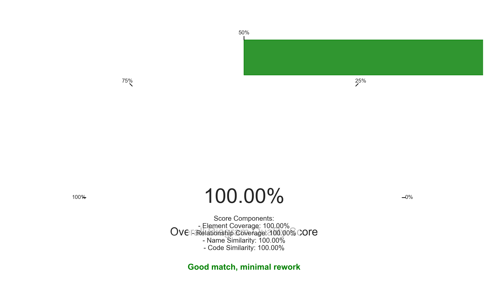
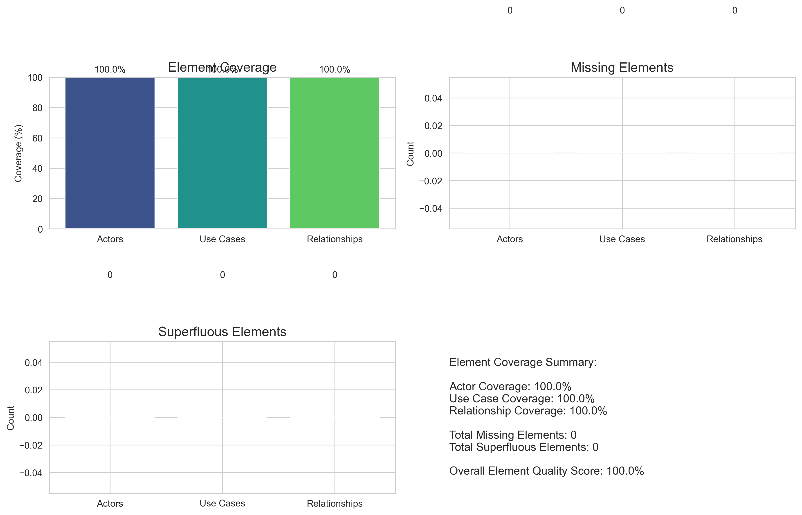
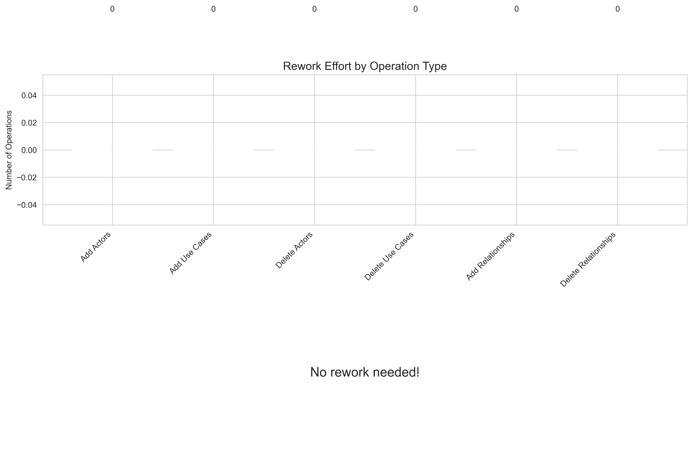
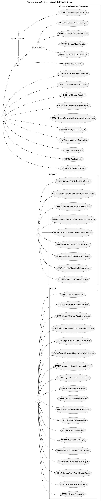
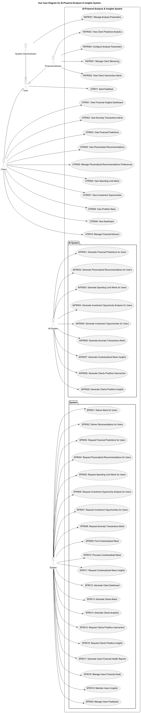
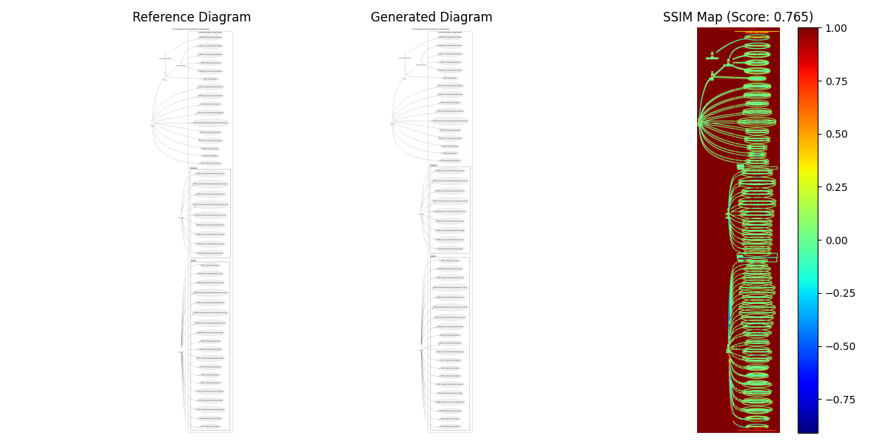
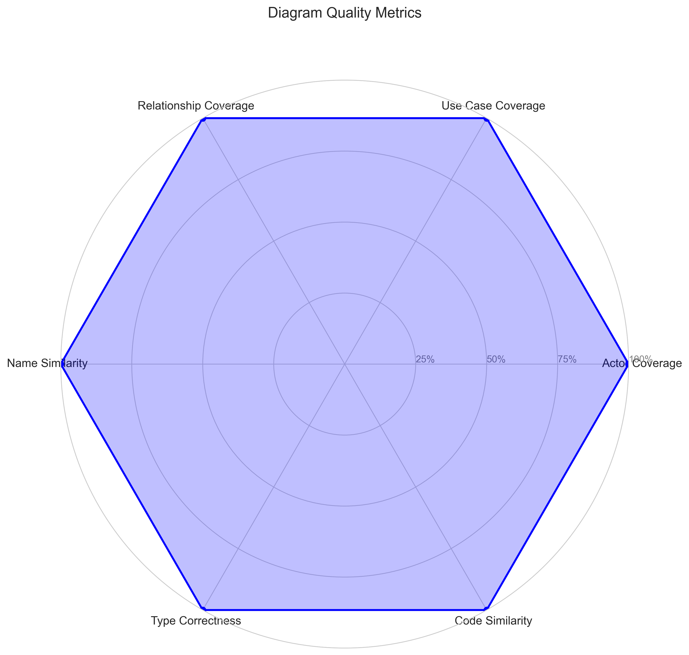
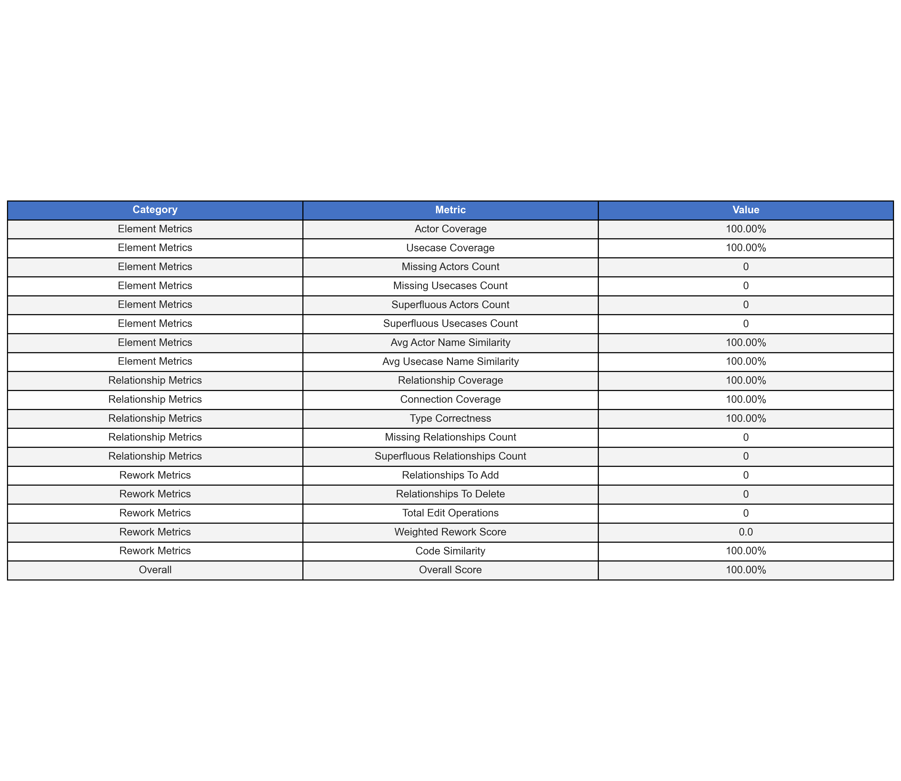

# UML Use Case Diagram Comparison Report

## Overview

**Model Evaluated:** <built-in method replace of str object at 0x709f1c1fdfb0>
**Comparison Date:** 2025-04-16 21:25:58
**Overall Quality Score:** 100.00%

Minimal rework is needed. The generated diagram captures most of the essential elements and relationships from the reference diagram.

## 1. Overall Comparison

The comparison between the reference and generated UML use case diagrams shows:

- **Element Coverage:** 100.00%
- **Relationship Coverage:** 100.00%
- **Total Edits Required:** 0 (0 element edits, 0 relationship edits)

## 2. Element Analysis

### Key Metrics:

- **Actor Coverage:** 100.00%
- **Use Case Coverage:** 100.00%
- **Missing Actors:** 0
- **Missing Use Cases:** 0
- **Extra Actors:** 0
- **Extra Use Cases:** 0

### Missing Elements:

**Missing Actors:** None

**Missing Use Cases:** None

### Extra Elements:

**Extra Actors:** None

**Extra Use Cases:** None

## 3. Relationship Analysis

### Key Metrics:

- **Relationship Coverage:** 100.00%
- **Type Correctness:** 100.00%
- **Missing Relationships:** 0
- **Extra Relationships:** 0

### Relationship Types:

| Type           | Reference Count | Generated Count |
| -------------- | --------------- | --------------- |
| generalization | 3               | 3               |
| association    | 45              | 45              |

## 4. Rework Analysis

### Required Edit Operations:

- **Add Actors:** 0
- **Add Use Cases:** 0
- **Delete Actors:** 0
- **Delete Use Cases:** 0
- **Add Relationships:** 0
- **Delete Relationships:** 0
- **Total Edit Operations:** 0
- **Weighted Rework Score:** 0.00

## 5. Visualization Comparison

### Diagrams Comparison

<table>
  <tr>
    <td><b>Reference Diagram</b></td>
    <td><b>Generated Diagram</b></td>
  </tr>
  <tr>
    <td></td>
    <td></td>
  </tr>
</table>

### Image Similarity Metrics:

- **SSIM Score:** 0.7654
- **MSE:** 34.79
- **Histogram Correlation:** 1.0000

## 6. Key Metrics Overview

## 7. Detailed Metrics

## 8. Recommendations

Based on the analysis, here are the recommended actions to convert the generated diagram to match the reference:

## 9. Conclusion

The generated diagram shows **excellent** alignment with the reference diagram. Very minimal adjustments are needed.
