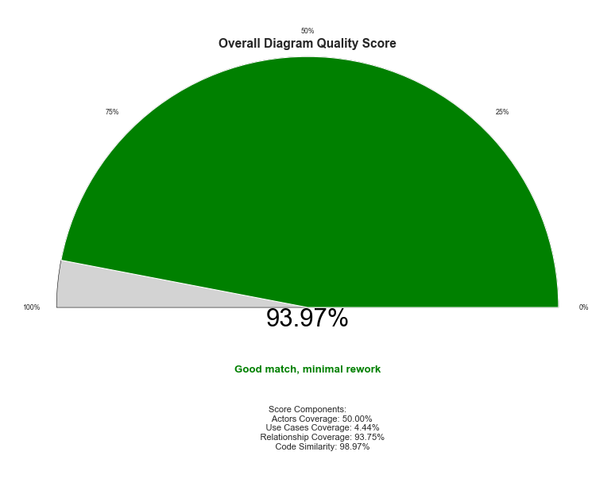
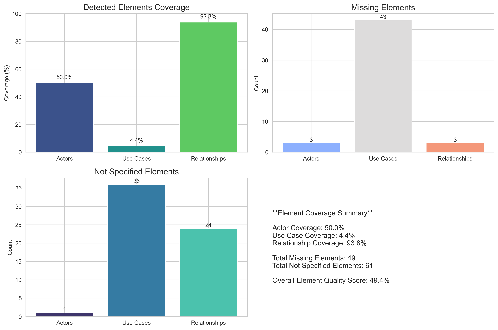
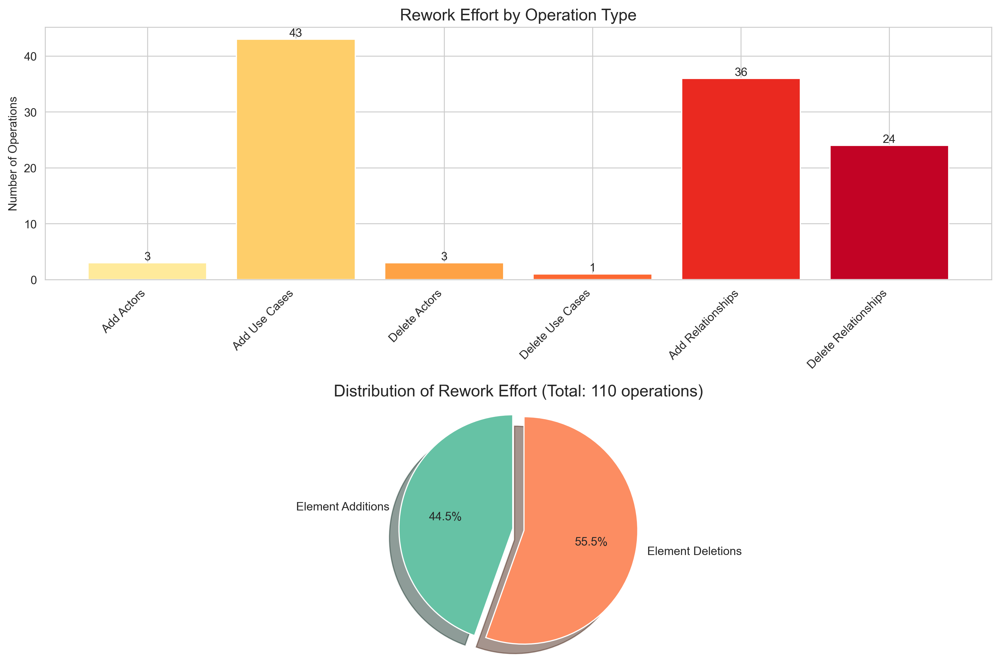
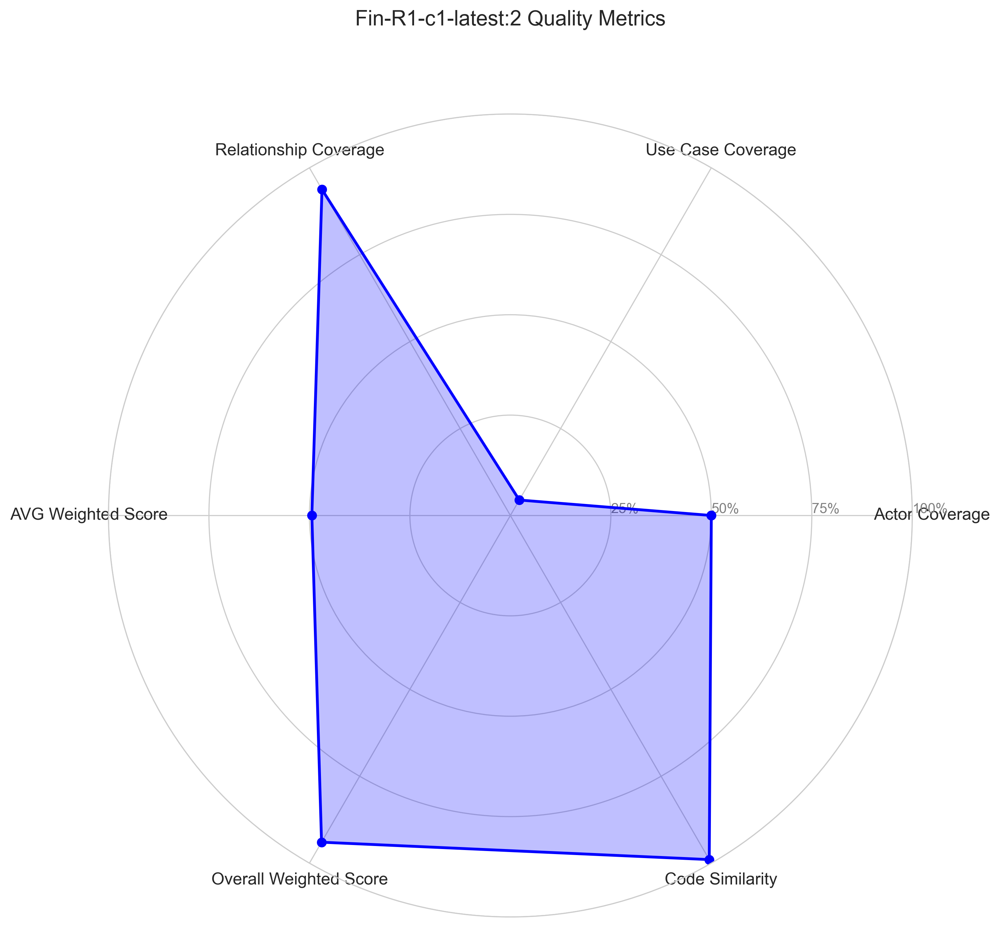
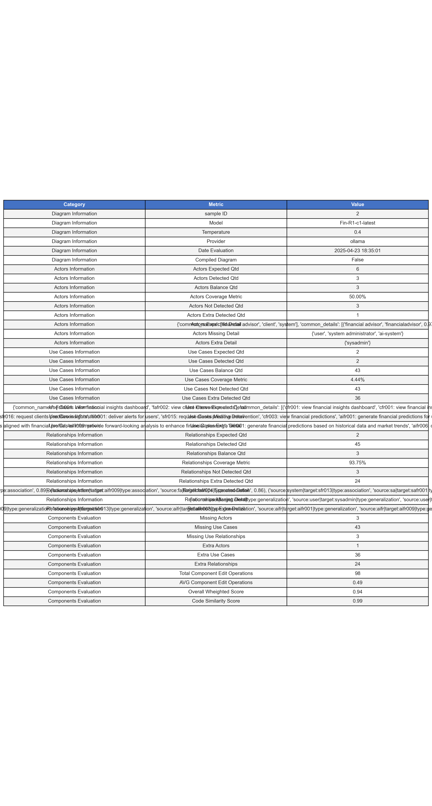

# UML Use Case Diagram Comparison Report
---
**Model Evaluated:** Fin-R1-c1-latest  
**Model Temperature:** 0.4  
**Model Prover:** ollama  
**Model Sample ID:** 2  
**Comparison Date:** 2025-04-23 18:35:01  
**Overall Quality Score:** 93.97%

**EVALUATION RESUME**:Too costly to fix. It may be better to rebuild the diagram from scratch.

---

## 1. Overall Comparison

The comparison between the reference and generated UML use case diagrams shows:

- **Element Expected:** {'actors': 6, 'use_cases': 45, 'relationships': 48}
- **Element Comparison:** 49.40%
    - **Actors:** **3** detected of **6**
    - **Use Cases:** **2** detected of **2**
    - **Relationships:** **45** detected of **2**

- **Total Edits Required:** **{'actors': 3, 'use_cases': 43, 'relationships': 3}** to add, **{'actors': 1, 'use_cases': 36, 'relationships': 24}** to delete 
    - **Actors:** **3** to add, **1** to delete.
    - **Use Cases:** **43** to add, **36** to delete.
    - **Relationships:** **3** to add, **24** to delete.

---

## 2. Elements Analysis

### Elements Key Metrics:

    - **Actor Coverage %:** 50.00%
    - **Use Case Coverage %:** 4.44%
    - **Relationships Coverage %:** 93.75%
    - **Missing Actors Qtd:** 3
    - **Missing Use Cases Qtd:** 43
    - **Missing Relationships Qtd:** 3
    - **Not Specified Actors Qtd:** 1
    - **Not Specified Use Cases Qtd:** 36
    - **Not Specified Relationships Qtd:** 24

    

### Elements Generated:

The LLM specifies the following elements according to the reference specification

**Generated Actors:**
- client
- financial advisor
- system

**Generated Use Cases:**
- cfr001: view financial insights dashboard
- fafr002: view client intervention alerts

**Generated Relationships:**
- **source** aisystem --> **target** aifr001 (type: association)
- **source** aisystem --> **target** aifr002 (type: association)
- **source** aisystem --> **target** aifr003 (type: association)
- **source** aisystem --> **target** aifr004 (type: association)
- **source** aisystem --> **target** aifr005 (type: association)
- **source** aisystem --> **target** aifr006 (type: association)
- **source** aisystem --> **target** aifr007 (type: association)
- **source** aisystem --> **target** aifr008 (type: association)
- **source** aisystem --> **target** aifr009 (type: association)
- **source** client --> **target** cfr001 (type: association)
- **source** client --> **target** cfr002 (type: association)
- **source** client --> **target** cfr003 (type: association)
- **source** client --> **target** cfr004 (type: association)
- **source** client --> **target** cfr005 (type: association)
- **source** client --> **target** cfr006 (type: association)
- **source** client --> **target** cfr007 (type: association)
- **source** client --> **target** cfr008 (type: association)
- **source** client --> **target** cfr009 (type: association)
- **source** client --> **target** cfr010 (type: association)
- **source** financialadvisor --> **target** fafr001 (type: association)
- **source** financialadvisor --> **target** fafr002 (type: association)
- **source** financialadvisor --> **target** fafr003 (type: association)
- **source** financialadvisor --> **target** fafr004 (type: association)
- **source** sysadmin --> **target** safr001 (type: association)
- **source** system --> **target** sfr001 (type: association)
- **source** system --> **target** sfr002 (type: association)
- **source** system --> **target** sfr003 (type: association)
- **source** system --> **target** sfr004 (type: association)
- **source** system --> **target** sfr005 (type: association)
- **source** system --> **target** sfr006 (type: association)
- **source** system --> **target** sfr007 (type: association)
- **source** system --> **target** sfr008 (type: association)
- **source** system --> **target** sfr009 (type: association)
- **source** system --> **target** sfr010 (type: association)
- **source** system --> **target** sfr011 (type: association)
- **source** system --> **target** sfr012 (type: association)
- **source** system --> **target** sfr013 (type: association)
- **source** system --> **target** sfr014 (type: association)
- **source** system --> **target** sfr015 (type: association)
- **source** system --> **target** sfr016 (type: association)
- **source** system --> **target** sfr017 (type: association)
- **source** system --> **target** sfr018 (type: association)
- **source** system --> **target** sfr019 (type: association)
- **source** system --> **target** sfr020 (type: association)
- **source** user --> **target** cfr011 (type: association)

### Elements Not Generated:

The LLM no longer specifies the following elements according to the reference specification

    **Missing Actors:**
- ai-system
- system administrator
- user

**Missing Use Cases:**
- aifr001: generate financial predictions for users
- aifr002: generate personalized recommendations for users
- aifr003: generate spending limit alerts for users
- aifr004: generate investment opportunity analysis for users
- aifr005: generate investment opportunities for users
- aifr006: generate anomaly transactions alerts
- aifr007: generate contextualized news insights
- aifr008: generate clients preditive intervention
- aifr009: generate clients preditive insights
- cfr002: view anomaly transactions alerts
- cfr003: view financial predictions
- cfr004: view personalized recommendations
- cfr005: manage personalized recommendations preferences
- cfr006: view spending limit alerts
- cfr007: view investment opportunities
- cfr008: view portfolio news
- cfr009: view dashboard
- cfr010: manage financial advisors
- cfr011: send feedback
- fafr001: manage client mentoring
- fafr003: view client predictive analytics
- fafr004: configure analysis parameters
- safr001: manage analysis parameters
- sfr001: deliver alerts for users
- sfr002: deliver recomendations for users
- sfr003: request financial predictions for users
- sfr004: request personalized recommendations for users
- sfr005: request spending limit alerts for users
- sfr006: request investment opportunity analysis for users
- sfr007: request investment opportunities for users
- sfr008: request anomaly transactions alerts
- sfr009: find contextualized news
- sfr010: proccess contextualized news
- sfr011: request contextualized news insights
- sfr012: generate client dashboard
- sfr013: generate clients alerts
- sfr014: generate clients analytics
- sfr015: request clients preditive intervention
- sfr016: request clients preditive insights
- sfr017: generate users financial health reports
- sfr018: manage users financial goals
- sfr019: maintain users insights
- sfr020: manage users feedbacks

**Missing Relationships:**
- **source** user --> **target** client (type: generalization)
- **source** user --> **target** financialadvisor (type: generalization)
- **source** user --> **target** sysadmin (type: generalization)

### Elements Not Specified But Generated:

The LLM specified the following elements outside the reference specification

        **Actors Not Specified In Reference:**
- sysadmin

**Use Cases Not Specified In Reference:**
- aifr001: generate financial predictions based on historical data and market trends
- aifr002: provide personalized recommendations aligning with user profiles
- aifr003: identify spending limit alerts for unusual activity
- aifr004: evaluate investment opportunities against risk profiles and goals
- aifr005: select investments aligning with user strategies (mpt)
- aifr006: detect anomalous transactions in compliance with fincen rules
- aifr007: correlate financial news with portfolios for relevant insights
- aifr008: recommend timing of intervention based on client patterns
- aifr009: provide forward-looking analysis to enhance financial planning
- cfr002: receive alerts for anomalous transactions
- cfr003: view financial predictions based on historical data and market trends
- cfr004: get personalized recommendations aligned with financial profile
- cfr005: manage preferences for personalized recommendations
- cfr006: view spending limit alerts exceeding predefined thresholds
- cfr007: access investment opportunities based on risk profile (mifid ii)
- cfr008: view news related to portfolio
- cfr009: manage relationship with financial advisors including data sharing permissions
- fafr001: manage client mentoring sessions based on insights
- fafr003: view predictive analytics for clients' financial situations
- fafr004: configure analysis parameters by client segment
- safr001: manage analysis parameters for ai system
- sfr001: deliver alerts through notification channels
- sfr002: provide personalized recommendations based on profiles
- sfr003: request financial predictions from ai component
- sfr004: request personalized recommendations from ai component
- sfr005: request spending limit alerts when exceeding thresholds
- sfr006: request investment opportunity analysis based on risk profile
- sfr007: find specific investments matching user criteria and esg preferences
- sfr008: detect anomaly transaction alerts for fraud prevention (aml)
- sfr009: extract contextualized news relevant to portfolio
- sfr010: generate client dashboards with financial information
- sfr011: process contextualized news insights for users' portfolios
- sfr012: request predictive intervention analyses from ai component
- sfr013: track financial goals and progress
- sfr014: maintain historical record of insights for trend analysis
- sfr015: manage user feedback to improve system quality

**Relationships Not Specified In Reference:**
- **source** aifr --> **target** aifr001 (type: generalization)
- **source** aifr --> **target** aifr002 (type: generalization)
- **source** aifr --> **target** aifr003 (type: generalization)
- **source** aifr --> **target** aifr004 (type: generalization)
- **source** aifr --> **target** aifr005 (type: generalization)
- **source** aifr --> **target** aifr006 (type: generalization)
- **source** aifr --> **target** aifr007 (type: generalization)
- **source** aifr --> **target** aifr008 (type: generalization)
- **source** aifr --> **target** aifr009 (type: generalization)
- **source** syst --> **target** sfr001 (type: generalization)
- **source** syst --> **target** sfr002 (type: generalization)
- **source** syst --> **target** sfr003 (type: generalization)
- **source** syst --> **target** sfr004 (type: generalization)
- **source** syst --> **target** sfr005 (type: generalization)
- **source** syst --> **target** sfr006 (type: generalization)
- **source** syst --> **target** sfr007 (type: generalization)
- **source** syst --> **target** sfr008 (type: generalization)
- **source** syst --> **target** sfr009 (type: generalization)
- **source** syst --> **target** sfr010 (type: generalization)
- **source** syst --> **target** sfr011 (type: generalization)
- **source** syst --> **target** sfr012 (type: generalization)
- **source** syst --> **target** sfr013 (type: generalization)
- **source** syst --> **target** sfr014 (type: generalization)
- **source** syst --> **target** sfr015 (type: generalization)

## 3. Rework Analysis

### Required Edit Operations:
    - **Actors to Add:** 3
    - **Use Cases to Add:** 43
    - **Relationships to Add:** 3
    - **Total Add Operations:** 49

    - **Actors to Delete:** 1
    - **Use Cases to Delete:** 36
    - **Relationships to Delete:** 24
    - **Total Delete Operations:** 61

    - **Total Edit Operations:** 98

    - **AVG Rework Score:** 0.49
        ( arithimetic_avg_for_detected_components = (detected_actor_coverage + detected_usecase_coverage + detected_relationships_coverage) / 3)

### Weighted Rework Score

    The **Weighted Rework Score** is a normalized metric (ranging from 0 to 1) that estimates the proportion of effort required to adjust the generated UML use case diagram to align with the reference specification.

    This score accounts for the number and type of modifications needed — including additions and deletions of actors, use cases, and relationships — weighted by their relative effort. The final value is normalized by the total number of elements in the reference diagram, enabling consistent interpretation across different diagram sizes.

    The higher the score, the more extensive the rework required. A score close to 1 suggests that the diagram may be easier to rebuild from scratch than to fix.

    | Weighted Rework Score | Interpretation                              |
    |-----------------------|---------------------------------------------|
    | 0.00 - 0.20           | Diagram ready or requires minimal fixes   |
    | 0.21 - 0.40           | Minor rework needed                      |
    | 0.41 - 0.60           | Moderate rework required                 |
    | 0.61 - 0.80           | Heavy rework, consider redoing           |
    | 0.81 - 1.00           | Too costly to fix, better rebuild         |

- **Overall Rework Score:** 0.94

## 4. Visualization Comparison

### Reference and Generated Diagrams
<table>
<tr>
    <td><b>Reference Diagram</b></td>
    <td><b>Generated Diagram</b></td>
</tr>
<tr>
    <td></td>
    <td></td>
</tr>
</table>

### Image Similarity Analysis Between Reference and Generated Diagrams

To complement the structural and semantic evaluation of the UML use case diagrams, was also performed an image-level similarity analysis. 
This allows to assess how visually similar the generated diagram is to the reference diagram — particularly important for evaluating general recognizability.

The following metrics were used:

- **SSIM (Structural Similarity Index)**
    SSIM measures the perceptual similarity between two images by comparing structural information, luminance, and contrast.  
    The value ranges from **0 (no similarity)** to **1 (perfect similarity)**.  
    This metric is widely adopted in image quality assessment because it aligns well with human visual perception.

- **MSE (Mean Squared Error)**
    MSE measures the average squared difference between the pixel intensities of the reference and the generated diagram.  
    Lower values indicate **higher similarity**.
    MSE is sensitive to even minor shifts or layout adjustments, so it is typically interpreted in combination with SSIM.

- **Histogram Correlation**
    This metric compares the distribution of pixel intensities (histograms) in both images.
    A value close to **1** indicates that the overall pixel intensity patterns are similar, even if the exact layout or structure differs.  
    This is useful to detect global visual consistency even when fine-grained alignment is not perfect.

        ### Image Similarity Metrics:
        - **SSIM Score for** `ollama-Fin-R1-c1-latest-temp0.4-collect-2.png`: 0.0000
        - **MSE:** 0.00
        - **Histogram Correlation:** 0.0000

        

        
        
## 5. Key Metrics Overview

## 6. Detailed Metrics

## 7. Conclusion

        The generated diagram shows **poor alignment**. Rebuilding from scratch may be more efficient than fixing the current version. 

---

        