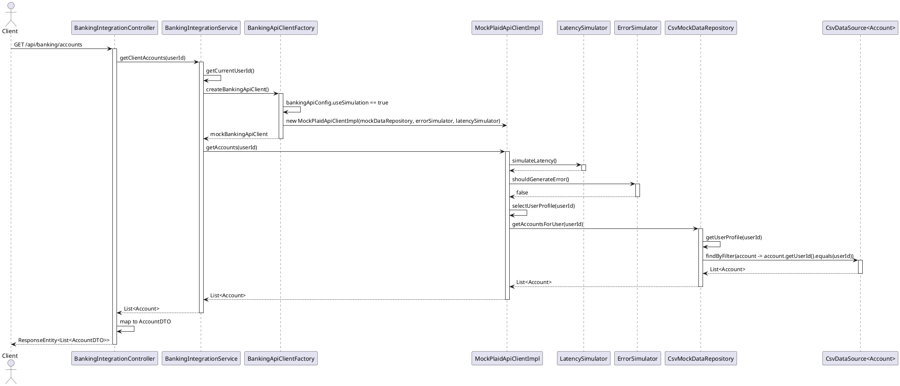
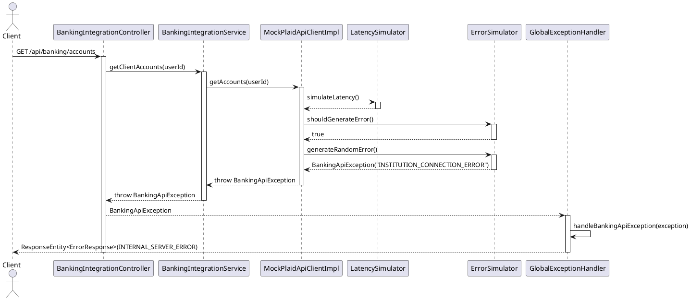
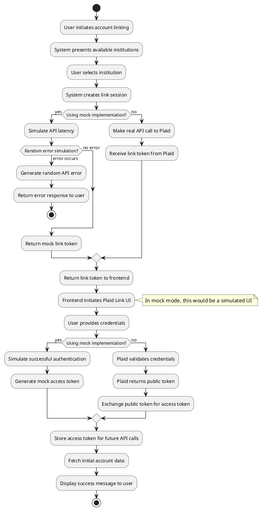

# C4 Code-Level Documentation
## FR01: Banking API Simulation Implementation

This document provides detailed implementation guidelines for FR01: "The system shall demonstrate simulated connection to banking APIs (mocked data)". It focuses on implementing a simulated Plaid API integration using synthetic financial datasets.

## 1. Class Diagram

```plantuml
@startuml "FR01 - Banking API Simulation - Class Diagram"

package com.financemanager.integration.banking {
    interface BankingApiClient {
        +getAccounts(String userId): List<Account>
        +getTransactions(String userId, String accountId, LocalDate startDate, LocalDate endDate): List<Transaction>
        +getAccountBalances(String userId): List<AccountBalance>
        +getInstitutions(): List<Institution>
        +linkUserAccount(String userId, String institutionId, LinkSessionConfig config): LinkSession
    }
    
    class PlaidApiClientImpl implements BankingApiClient {
        -apiConfig: PlaidApiConfig
        -httpClient: HttpClient
        -errorSimulator: ErrorSimulator
        -latencySimulator: LatencySimulator
        +getAccounts(String userId): List<Account>
        +getTransactions(String userId, String accountId, LocalDate startDate, LocalDate endDate): List<Transaction>
        +getAccountBalances(String userId): List<AccountBalance>
        +getInstitutions(): List<Institution>
        +linkUserAccount(String userId, String institutionId, LinkSessionConfig config): LinkSession
        -mapToAccountModel(PlaidAccount): Account
        -mapToTransactionModel(PlaidTransaction): Transaction
    }
    
    class MockPlaidApiClientImpl implements BankingApiClient {
        -mockDataRepository: MockDataRepository
        -errorSimulator: ErrorSimulator
        -latencySimulator: LatencySimulator
        +getAccounts(String userId): List<Account>
        +getTransactions(String userId, String accountId, LocalDate startDate, LocalDate endDate): List<Transaction>
        +getAccountBalances(String userId): List<AccountBalance>
        +getInstitutions(): List<Institution>
        +linkUserAccount(String userId, String institutionId, LinkSessionConfig config): LinkSession
        -simulateLatency(): void
        -simulateRandomError(): void
        -selectUserProfile(String userId): UserProfile
    }
    
    interface MockDataRepository {
        +getAccountsForUser(String userId): List<Account>
        +getTransactionsForAccount(String userId, String accountId, LocalDate startDate, LocalDate endDate): List<Transaction>
        +getBalancesForUser(String userId): List<AccountBalance>
        +getInstitutions(): List<Institution>
        +getUserProfile(String userId): UserProfile
    }
    
    class CsvMockDataRepository implements MockDataRepository {
        -accountsDataSource: DataSource<Account>
        -transactionsDataSource: DataSource<Transaction>
        -balancesDataSource: DataSource<AccountBalance>
        -institutionsDataSource: DataSource<Institution>
        -userProfilesMap: Map<String, UserProfile>
        +getAccountsForUser(String userId): List<Account>
        +getTransactionsForAccount(String userId, String accountId, LocalDate startDate, LocalDate endDate): List<Transaction>
        +getBalancesForUser(String userId): List<AccountBalance>
        +getInstitutions(): List<Institution>
        +getUserProfile(String userId): UserProfile
        -loadUserProfiles(): void
        -loadDataSources(): void
    }
    
    interface DataSource<T> {
        +getAll(): List<T>
        +findById(String id): Optional<T>
        +findByFilter(Predicate<T> filter): List<T>
    }
    
    class CsvDataSource<T> implements DataSource {
        -filePath: String
        -mapper: Function<String[], T>
        -entities: List<T>
        +getAll(): List<T>
        +findById(String id): Optional<T>
        +findByFilter(Predicate<T> filter): List<T>
        -loadData(): void
        -parseLine(String line): T
    }
    
    class ErrorSimulator {
        -errorRate: double
        -random: Random
        +shouldGenerateError(): boolean
        +generateRandomError(): BankingApiException
    }
    
    class LatencySimulator {
        -minLatencyMs: long
        -maxLatencyMs: long
        -random: Random
        +simulateLatency(): void
    }
    
    class BankingApiException extends RuntimeException {
        -errorCode: String
        -httpStatus: HttpStatus
        +BankingApiException(String message, String errorCode, HttpStatus httpStatus)
        +getErrorCode(): String
        +getHttpStatus(): HttpStatus
    }
    
    class UserProfile {
        -userId: String
        -profileType: ProfileType
        -riskTolerance: RiskTolerance
        -monthlyIncome: BigDecimal
        -financialGoals: List<String>
        -preferredCategories: List<String>
    }
    
    enum ProfileType {
        CONSERVATIVE
        BALANCED
        SPENDER
        INVESTOR
        DEBTOR
    }
    
    enum RiskTolerance {
        LOW
        MEDIUM
        HIGH
    }
    
    class BankingApiConfig {
        -baseUrl: String
        -clientId: String
        -secret: String
        -useSimulation: boolean
        -errorRate: double
        -minLatencyMs: long
        -maxLatencyMs: long
    }
}

package com.financemanager.integration.banking.model {
    class Account {
        -id: String
        -userId: String
        -institutionId: String
        -accountNumber: String
        -mask: String
        -name: String
        -officialName: String
        -type: AccountType
        -subtype: AccountSubType
        -status: AccountStatus
    }
    
    enum AccountType {
        CHECKING
        SAVINGS
        CREDIT
        INVESTMENT
        LOAN
        OTHER
    }
    
    enum AccountSubType {
        // Various subtypes...
    }
    
    enum AccountStatus {
        ACTIVE
        INACTIVE
        CLOSED
    }
    
    class Transaction {
        -id: String
        -accountId: String
        -amount: BigDecimal
        -date: LocalDate
        -name: String
        -merchantName: String
        -isPending: boolean
        -categories: List<String>
        -location: TransactionLocation
        -paymentChannel: PaymentChannel
    }
    
    class TransactionLocation {
        -address: String
        -city: String
        -region: String
        -postalCode: String
        -country: String
        -lat: Double
        -lon: Double
    }
    
    enum PaymentChannel {
        ONLINE
        IN_STORE
        OTHER
    }
    
    class AccountBalance {
        -accountId: String
        -available: BigDecimal
        -current: BigDecimal
        -limit: BigDecimal
        -isoCurrencyCode: String
        -lastUpdatedDatetime: LocalDateTime
    }
    
    class Institution {
        -id: String
        -name: String
        -logo: String
        -primaryColor: String
        -url: String
        -countryCodes: List<String>
        -products: List<String>
        -oauth: boolean
    }
    
    class LinkSession {
        -linkToken: String
        -expiration: LocalDateTime
        -userId: String
        -institutionId: String
    }
    
    class LinkSessionConfig {
        -products: List<String>
        -countryCodes: List<String>
        -language: String
    }
}

package com.financemanager.integration.banking.service {
    class BankingIntegrationService {
        -bankingApiClient: BankingApiClient
        -bankingApiClientFactory: BankingApiClientFactory
        +getClientAccounts(String userId): List<Account>
        +getAccountTransactions(String userId, String accountId, Period period): List<Transaction>
        +getClientBalances(String userId): List<AccountBalance>
        +getAvailableInstitutions(): List<Institution>
        +initiateAccountLinking(String userId, String institutionId): LinkSession
    }
    
    class BankingApiClientFactory {
        -bankingApiConfig: BankingApiConfig
        -mockDataRepository: MockDataRepository
        +createBankingApiClient(): BankingApiClient
        -createRealClient(): PlaidApiClientImpl
        -createMockClient(): MockPlaidApiClientImpl
    }
}

package com.financemanager.integration.banking.controller {
    class BankingIntegrationController {
        -bankingIntegrationService: BankingIntegrationService
        +getAccounts(): ResponseEntity<List<AccountDTO>>
        +getTransactions(String accountId, Period period): ResponseEntity<List<TransactionDTO>>
        +getBalances(): ResponseEntity<List<AccountBalanceDTO>>
        +getInstitutions(): ResponseEntity<List<InstitutionDTO>>
        +initiateAccountLinking(String institutionId): ResponseEntity<LinkSessionDTO>
    }
    
    class AccountDTO {
        // DTO fields
    }
    
    class TransactionDTO {
        // DTO fields
    }
    
    class AccountBalanceDTO {
        // DTO fields
    }
    
    class InstitutionDTO {
        // DTO fields
    }
    
    class LinkSessionDTO {
        // DTO fields
    }
}

BankingIntegrationController --> BankingIntegrationService
BankingIntegrationService --> BankingApiClientFactory
BankingApiClientFactory --> PlaidApiClientImpl
BankingApiClientFactory --> MockPlaidApiClientImpl
MockPlaidApiClientImpl --> MockDataRepository
MockPlaidApiClientImpl --> ErrorSimulator
MockPlaidApiClientImpl --> LatencySimulator
CsvMockDataRepository --> DataSource
PlaidApiClientImpl --> BankingApiException

@enduml
```



## 2. Sequence Diagram for Getting User Accounts



## 3. Sequence Diagram for Error Handling



## 4. Activity Diagram for Account Linking Process



## 5. Implementation Details

### 5.1 Configuration

#### Application Properties

```properties
# Banking API Configuration
banking.api.use-simulation=true
banking.api.error-rate=0.05
banking.api.min-latency-ms=100
banking.api.max-latency-ms=500

# Plaid API Configuration (used only when simulation is disabled)
plaid.api.base-url=https://sandbox.plaid.com
plaid.api.client-id=${PLAID_CLIENT_ID:sandbox_id}
plaid.api.secret=${PLAID_SECRET:sandbox_secret}

# Mock Data Configuration
mock.data.accounts-file=classpath:mock-data/accounts.csv
mock.data.transactions-file=classpath:mock-data/transactions.csv
mock.data.balances-file=classpath:mock-data/balances.csv
mock.data.institutions-file=classpath:mock-data/institutions.csv
mock.data.user-profiles-file=classpath:mock-data/user-profiles.csv
```

#### Java Configuration Class

```java
@Configuration
@ConfigurationProperties(prefix = "banking.api")
@Getter
@Setter
public class BankingApiConfig {
    private String baseUrl;
    private String clientId;
    private String secret;
    private boolean useSimulation;
    private double errorRate;
    private long minLatencyMs;
    private long maxLatencyMs;
}

@Configuration
@ConfigurationProperties(prefix = "mock.data")
@Getter
@Setter
public class MockDataConfig {
    private String accountsFile;
    private String transactionsFile;
    private String balancesFile;
    private String institutionsFile;
    private String userProfilesFile;
}

@Configuration
public class BankingIntegrationConfig {
    
    @Bean
    public ErrorSimulator errorSimulator(BankingApiConfig config) {
        return new ErrorSimulator(config.getErrorRate());
    }
    
    @Bean
    public LatencySimulator latencySimulator(BankingApiConfig config) {
        return new LatencySimulator(config.getMinLatencyMs(), config.getMaxLatencyMs());
    }
    
    @Bean
    public MockDataRepository mockDataRepository(MockDataConfig config) {
        return new CsvMockDataRepository(
            config.getAccountsFile(),
            config.getTransactionsFile(),
            config.getBalancesFile(),
            config.getInstitutionsFile(),
            config.getUserProfilesFile()
        );
    }
    
    @Bean
    public BankingApiClientFactory bankingApiClientFactory(
            BankingApiConfig apiConfig,
            MockDataRepository mockDataRepository,
            ErrorSimulator errorSimulator,
            LatencySimulator latencySimulator) {
        return new BankingApiClientFactory(apiConfig, mockDataRepository, errorSimulator, latencySimulator);
    }
    
    @Bean
    public BankingIntegrationService bankingIntegrationService(BankingApiClientFactory factory) {
        return new BankingIntegrationService(factory);
    }
}
```

### 5.2 Mock Data Structure

#### accounts.csv

```csv
id,userId,institutionId,accountNumber,mask,name,officialName,type,subtype,status
acc_1,user_conservative,ins_chase,123456789,1234,Chase Checking,Chase Total Checking,CHECKING,CHECKING,ACTIVE
acc_2,user_conservative,ins_chase,987654321,4321,Chase Savings,Chase Savings Account,SAVINGS,SAVINGS,ACTIVE
acc_3,user_spender,ins_bofa,456789123,7890,BofA Credit Card,Bank of America Premium Rewards,CREDIT,CREDIT_CARD,ACTIVE
acc_4,user_spender,ins_bofa,654321987,6543,BofA Checking,Bank of America Advantage,CHECKING,CHECKING,ACTIVE
acc_5,user_investor,ins_fidelity,789123456,9876,Fidelity Investment,Fidelity Brokerage Account,INVESTMENT,BROKERAGE,ACTIVE
acc_6,user_investor,ins_chase,321654987,5432,Chase Checking,Chase Premier Checking,CHECKING,CHECKING,ACTIVE
acc_7,user_debtor,ins_chase,159753468,1597,Chase Credit Card,Chase Sapphire Reserve,CREDIT,CREDIT_CARD,ACTIVE
acc_8,user_debtor,ins_lending_club,753159852,7531,Personal Loan,LendingClub Personal Loan,LOAN,PERSONAL_LOAN,ACTIVE
acc_9,user_balanced,ins_wells,456123789,4561,Wells Fargo Checking,Wells Fargo Everyday Checking,CHECKING,CHECKING,ACTIVE
acc_10,user_balanced,ins_wells,789456123,7894,Wells Fargo Savings,Wells Fargo Way2Save,SAVINGS,SAVINGS,ACTIVE
```

#### institutions.csv

```csv
id,name,logo,primaryColor,url,countryCodes,products,oauth
ins_chase,Chase Bank,https://logo.clearbit.com/chase.com,#117ACA,https://chase.com,"US","checking,savings,credit",true
ins_bofa,Bank of America,https://logo.clearbit.com/bankofamerica.com,#E11A2C,https://bankofamerica.com,"US","checking,savings,credit",true
ins_wells,Wells Fargo,https://logo.clearbit.com/wellsfargo.com,#D71E28,https://wellsfargo.com,"US","checking,savings,credit",true
ins_citi,Citibank,https://logo.clearbit.com/citi.com,#157DFF,https://citi.com,"US","checking,savings,credit",true
ins_capital_one,Capital One,https://logo.clearbit.com/capitalone.com,#C9002B,https://capitalone.com,"US","checking,savings,credit",true
ins_fidelity,Fidelity,https://logo.clearbit.com/fidelity.com,#458E3A,https://fidelity.com,"US","investments",true
ins_vanguard,Vanguard,https://logo.clearbit.com/vanguard.com,#D81F2A,https://vanguard.com,"US","investments",true
ins_amex,American Express,https://logo.clearbit.com/americanexpress.com,#006FCF,https://americanexpress.com,"US","credit",true
ins_discover,Discover,https://logo.clearbit.com/discover.com,#F68121,https://discover.com,"US","credit",true
ins_lending_club,LendingClub,https://logo.clearbit.com/lendingclub.com,#119ED9,https://lendingclub.com,"US","loans",false
```

#### transactions.csv (excerpt)

```csv
id,accountId,amount,date,name,merchantName,isPending,categories,location_address,location_city,location_region,location_postalCode,location_country,paymentChannel
tx_1001,acc_1,-35.75,2023-05-01,Grocery Store Purchase,Whole Foods,false,"Food and Drink,Groceries",123 Main St,Austin,TX,78701,US,IN_STORE
tx_1002,acc_1,-12.49,2023-05-02,Online Subscription,Netflix,false,"Service,Entertainment",,,,,US,ONLINE
tx_1003,acc_1,-5.30,2023-05-03,Coffee Shop,Starbucks,false,"Food and Drink,Coffee Shop",456 Oak Ave,Austin,TX,78702,US,IN_STORE
tx_1004,acc_1,-1200.00,2023-05-03,Rent Payment,Acme Properties,false,"Housing,Rent",,Austin,TX,,US,OTHER
tx_1005,acc_1,2450.00,2023-05-05,Direct Deposit,ACME INC PAYROLL,false,"Income,Direct Deposit",,,,,,OTHER
tx_1006,acc_1,-85.75,2023-05-07,Utility Payment,City Power & Light,false,"Housing,Utilities",,,,,,ONLINE
```

#### user-profiles.csv

```csv
userId,profileType,riskTolerance,monthlyIncome,financialGoals,preferredCategories
user_conservative,CONSERVATIVE,LOW,5000.00,"emergency_fund,retirement","Savings,Investments,Necessities"
user_balanced,BALANCED,MEDIUM,6500.00,"home_purchase,college_fund,retirement","Investments,Travel,Health"
user_spender,SPENDER,MEDIUM,7000.00,"debt_reduction,vacation","Shopping,Dining,Entertainment"
user_investor,INVESTOR,HIGH,8500.00,"wealth_building,early_retirement","Investments,Technology,Business"
user_debtor,DEBTOR,LOW,4200.00,"debt_reduction,credit_score_improvement","Debt Payments,Necessities,Income"
```

### 5.3 Key Class Implementations

#### BankingApiClientFactory

```java
@Component
@RequiredArgsConstructor
public class BankingApiClientFactory {
    private final BankingApiConfig bankingApiConfig;
    private final MockDataRepository mockDataRepository;
    private final ErrorSimulator errorSimulator;
    private final LatencySimulator latencySimulator;
    
    public BankingApiClient createBankingApiClient() {
        if (bankingApiConfig.isUseSimulation()) {
            return createMockClient();
        } else {
            return createRealClient();
        }
    }
    
    private PlaidApiClientImpl createRealClient() {
        return new PlaidApiClientImpl(bankingApiConfig);
    }
    
    private MockPlaidApiClientImpl createMockClient() {
        return new MockPlaidApiClientImpl(mockDataRepository, errorSimulator, latencySimulator);
    }
}
```

#### MockPlaidApiClientImpl

```java
@Slf4j
public class MockPlaidApiClientImpl implements BankingApiClient {
    private final MockDataRepository mockDataRepository;
    private final ErrorSimulator errorSimulator;
    private final LatencySimulator latencySimulator;
    
    @Override
    public List<Account> getAccounts(String userId) {
        simulateLatency();
        simulateRandomError();
        
        log.info("Fetching mock accounts for user: {}", userId);
        UserProfile profile = selectUserProfile(userId);
        return mockDataRepository.getAccountsForUser(userId);
    }
    
    @Override
    public List<Transaction> getTransactions(String userId, String accountId, 
                                            LocalDate startDate, LocalDate endDate) {
        simulateLatency();
        simulateRandomError();
        
        log.info("Fetching mock transactions for account: {} between {} and {}", 
                accountId, startDate, endDate);
        return mockDataRepository.getTransactionsForAccount(userId, accountId, startDate, endDate);
    }
    
    @Override
    public List<AccountBalance> getAccountBalances(String userId) {
        simulateLatency();
        simulateRandomError();
        
        log.info("Fetching mock balances for user: {}", userId);
        return mockDataRepository.getBalancesForUser(userId);
    }
    
    @Override
    public List<Institution> getInstitutions() {
        simulateLatency();
        simulateRandomError();
        
        log.info("Fetching mock institutions");
        return mockDataRepository.getInstitutions();
    }
    
    @Override
    public LinkSession linkUserAccount(String userId, String institutionId, LinkSessionConfig config) {
        simulateLatency();
        simulateRandomError();
        
        log.info("Creating mock link session for user: {} and institution: {}", userId, institutionId);
        
        // Generate a mock link token
        String linkToken = "link-sandbox-" + UUID.randomUUID().toString();
        
        // Create link session expiring in 1 hour
        LocalDateTime expiration = LocalDateTime.now().plusHours(1);
        
        return new LinkSession(linkToken, expiration, userId, institutionId);
    }
    
    private void simulateLatency() {
        latencySimulator.simulateLatency();
    }
    
    private void simulateRandomError() {
        if (errorSimulator.shouldGenerateError()) {
            throw errorSimulator.generateRandomError();
        }
    }
    
    private UserProfile selectUserProfile(String userId) {
        return mockDataRepository.getUserProfile(userId);
    }
}
```

#### CsvMockDataRepository

```java
@Slf4j
public class CsvMockDataRepository implements MockDataRepository {
    private final DataSource<Account> accountsDataSource;
    private final DataSource<Transaction> transactionsDataSource;
    private final DataSource<AccountBalance> balancesDataSource;
    private final DataSource<Institution> institutionsDataSource;
    private final Map<String, UserProfile> userProfilesMap;
    
    public CsvMockDataRepository(String accountsFile, String transactionsFile, 
                               String balancesFile, String institutionsFile,
                               String userProfilesFile) {
        this.accountsDataSource = new CsvDataSource<>(accountsFile, this::mapToAccount);
        this.transactionsDataSource = new CsvDataSource<>(transactionsFile, this::mapToTransaction);
        this.balancesDataSource = new CsvDataSource<>(balancesFile, this::mapToBalance);
        this.institutionsDataSource = new CsvDataSource<>(institutionsFile, this::mapToInstitution);
        this.userProfilesMap = loadUserProfiles(userProfilesFile);
        
        log.info("Initialized CSV Mock Data Repository with {} accounts, {} transactions, {} balances, {} institutions, and {} user profiles",
                accountsDataSource.getAll().size(),
                transactionsDataSource.getAll().size(),
                balancesDataSource.getAll().size(),
                institutionsDataSource.getAll().size(),
                userProfilesMap.size());
    }
    
    @Override
    public List<Account> getAccountsForUser(String userId) {
        return accountsDataSource.findByFilter(account -> account.getUserId().equals(userId));
    }
    
    @Override
    public List<Transaction> getTransactionsForAccount(String userId, String accountId, 
                                                     LocalDate startDate, LocalDate endDate) {
        return transactionsDataSource.findByFilter(transaction -> 
                transaction.getAccountId().equals(accountId) &&
                !transaction.getDate().isBefore(startDate) &&
                !transaction.getDate().isAfter(endDate));
    }
    
    @Override
    public List<AccountBalance> getBalancesForUser(String userId) {
        // Get all account IDs for this user
        List<String> accountIds = getAccountsForUser(userId).stream()
                .map(Account::getId)
                .collect(Collectors.toList());
                
        return balancesDataSource.findByFilter(balance -> 
                accountIds.contains(balance.getAccountId()));
    }
    
    @Override
    public List<Institution> getInstitutions() {
        return institutionsDataSource.getAll();
    }
    
    @Override
    public UserProfile getUserProfile(String userId) {
        return userProfilesMap.getOrDefault(userId, createDefaultUserProfile(userId));
    }
    
    private UserProfile createDefaultUserProfile(String userId) {
        return new UserProfile(
            userId,
            ProfileType.BALANCED,
            RiskTolerance.MEDIUM,
            new BigDecimal("5000.00"),
            List.of("emergency_fund", "retirement"),
            List.of("Necessities", "Savings")
        );
    }
    
    private Map<String, UserProfile> loadUserProfiles(String filePath) {
        try {
            Resource resource = new ClassPathResource(filePath);
            List<String> lines = Files.readAllLines(Paths.get(resource.getURI()));
            
            Map<String, UserProfile> profiles = new HashMap<>();
            // Skip header line
            for (int i = 1; i < lines.size(); i++) {
                String[] fields = lines.get(i).split(",");
                UserProfile profile = mapToUserProfile(fields);
                profiles.put(profile.getUserId(), profile);
            }
            
            return profiles;
        } catch (IOException e) {
            log.error("Failed to load user profiles from {}", filePath, e);
            return Collections.emptyMap();
        }
    }
    
    // Mapping methods for CSV data
    private Account mapToAccount(String[] fields) {
        return new Account(
            fields[0], // id
            fields[1], // userId
            fields[2], // institutionId 
            fields[3], // accountNumber
            fields[4], // mask
            fields[5], // name
            fields[6], // officialName
            AccountType.valueOf(fields[7]), // type
            AccountSubType.valueOf(fields[8]), // subtype
            AccountStatus.valueOf(fields[9]) // status
        );
    }
    
    // Additional mapping methods for transactions, balances, institutions, user profiles
    // ...
}
```

#### ErrorSimulator