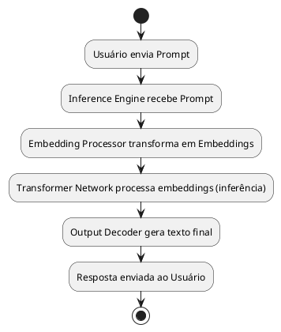

# Arquitetura de um Large Language Model (LLM) no C4 Model

Neste post, vamos representar um **Large Language Model (LLM)** usando o **C4 Model** - uma abordagem de modelagem arquitetural de sistemas em quatro níveis (Contexto, Container, COmponente e Código). A modelagem que construímos é realizada na sintaxe PlantUML, enriquecida por uma intepretação técnica.


📅 Nossa proposta é apresentar o LLM como um "sistema de software" completo, respeitando os paralelos com arquitetura de sistemas.

---

## Nível C1 - Contexto

### Visão geral

Um **LLM** é um sistema que recebe entradas (prompts) e devolve respostas fundamentadas em conhecimento treinado  utilizando aprendizado profundo em redes neurais Transformer.


**Principais componentes:**

- **Usuários:** humanos e sistemas externos.
- **Corpus de Treinamento:** Base de dados usada para treinar o modelo.
- **Infraestrutura de Execução:** Computação de alta performance (GPU/TPU).

### Diagrama de Contexto (PlantUML)

```plantuml
@startuml
!includeurl https://raw.githubusercontent.com/RicardoNiepel/C4-PlantUML/master/C4_Context.puml

Person(User, "Usuário", "Interage com o modelo enviando prompts.")
System(LLMSystem, "Large Language Model", "Gera respospostas baseadas em rede neural.")

System_Ext(TrainingCorpus, "Corpus de Treinamento", "Bases de dados estruturadas para treinamento do modelo.")


User -> LLMSystem : Envia prompt
LLMSystem -> User : Devolve resposta
LLMSystem -> TrainingCorpus : Aprende padrões
@enduml
```

---

## Nível C2 - Contêineres

### Visão geral

Dentro do sistema LLM, temos vários componentes arquiteturais que chamamos de contêineres. Cada um deles é responsável por uma etapa crítica no processamento da entrada do usuário e na geração da resposta. 

Durante o processamento de um prompt enviado pelo usuário, o fluxo é o seguinte:

1. O Inference Engine recebe o prompt.
2. O Embedding Processor converte o prompt em vetores numéricos.
3. Os vetores são enviados para o Transformer Neural Network, que executa o raciocínio e gera representações intermediárias.
4. O Output Decoder transforma as saídas da rede em texto legível.
5. Paralelamente, Fine-tuning Engine pode interagir durante treinamento ou ajustes para refinar os pesos do Transformer.


| Container                 | Papel                                                  | Importância                                          | Interações                                                                          |
|----------------------------|--------------------------------------------------------|------------------------------------------------------|-------------------------------------------------------------------------------------|
| **Embedding Processor**    | Converte tokens textuais em embeddings vetoriais.       | Inicia o processo semântico de entendimento da entrada. | Recebe prompts do Inference Engine. Envia embeddings para Transformer Network.     |
| **Transformer Neural Network** | Processa a inferência principal utilizando self-attention. | É o "cérebro" da geração de respostas.              | Recebe embeddings. Devolve hidden states para Output Decoder. Pode ser ajustado pelo Fine-tuning Engine. |
| **Inference Engine**       | Coordena o fluxo de inferência de ponta a ponta.         | Gerencia a execução orquestrando os módulos.         | Recebe prompt do usuário. Dispara cadeia de execução. Garante coesão do processo.   |
| **Output Decoder**         | Converte hidden states em texto natural.                | Torna as saídas interpretáveis para humanos.         | Recebe hidden states do Transformer e gera o texto final devolvido ao usuário.      |


### Diagrama de Containers (PlantUML)

```plantuml
@startuml
!define C4P https://raw.githubusercontent.com/RicardoNiepel/C4-PlantUML/master
!includeurl C4P/C4_Container.puml

System_Boundary(s1, "Large Language Model") {
  Container(InferenceEngine, "Inference Engine", "Python", "Gerencia o fluxo de inferência: recebe prompts, organiza o processo de execução.")
  Container(EmbeddingProcessor, "Embedding Processor", "TensorFlow", "Transforma texto em vetores densos semânticos.")
  Container(TransformerNetwork, "Transformer Neural Network", "PyTorch", "Executa a inferência com atenção e raciocínio.")
  Container(OutputDecoder, "Output Decoder", "Python", "Converte as representações vetoriais finais em texto legível.")
}

Rel(InferenceEngine, EmbeddingProcessor, "Envia prompts tokenizados")
Rel(EmbeddingProcessor, TransformerNetwork, "Fornece embeddings")
Rel(TransformerNetwork, OutputDecoder, "Envia hidden states")
Rel(TransformerNetwork, InferenceEngine, "Entrega saída processada")
@enduml
```

### Fluxo detalhado do processamento de um prompt


1. Usuário envia um prompt textual para o Inference Engine.
2. Inference Engine valida e organiza o fluxo de processamento:
   1. Ativa o Prompt Handler para normalização.
   2. Usa o Tokenization Module para tokenizar o texto.
3. Inference Engine envia a sequência tokenizada para o Embedding Processor.
4. Embedding Processor gera vetores de embeddings.
5. Transformer Network:
   1. Usa Self-Attention Layer para ponderar relações entre tokens.
   2. Feed-Forward Layer refina as representações.
   3. Hidden States Manager organiza a memória intermediária.
   4. Chain of Thought Manager induz raciocínios estruturados, se necessário.
   5. Induction Head promove generalização de padrões observados.
6. Output Decoder converte a saída em texto natural.
7. Inference Engine recebe o texto finalizado e responde ao Usuário.

Podemos representar o fluxo completo assim


Se fizermos umas analogias bem alto nível seria como se:

- O Inference Engine é o coordenador.
- O Embedding Processor é o tradutor.
- O Transformer é o cérebro.
- O Output Decoder é o embelezador.
- O Fine-tuning Engine é o tutor que ensina o cérebro a melhorar.

---

## Nível C3 - Componentes Internos 

### Compreensão do fluxo de processamento de um pompt

Para compreender melhor como os componentes internos do LLM iteragem para processar o token e gerar a resposta é importante compreender o fluxo sequencial de processamento:

| Etapa                     | O que acontece                                              | Componente               |
|----------------------------|-------------------------------------------------------------|---------------------------|
| **(1) Gera um token**      | O Transformer processa embeddings e gera um token           | TokenDecoder              |
| **(2) Verifica parada**    | Decide se continua ou não gerando                           | StopConditionChecker      |
| **(3) Atualiza contexto**  | Adiciona o novo token na janela para próxima predição        | ContextWindowManager      |
| **(4) Coleta tokens**      | Cada token gerado é acumulado sequencialmente               | OutputCollector           |
| **(5) Finaliza geração**   | Quando parada detectada, OutputCollector monta o texto final | OutputCollector           |
| **(6) Entrega resposta**   | OutputCollector entrega texto final para o PromptReceiver ou para a API que fez a chamada | (Novo fluxo que faltava!) |
| **(7) Resposta enviada ao usuário** | API responde ao usuário                            | PromptReceiver (se conectado diretamente) |


### Diagrama de Componentes (PlantUML)

```plantuml
@startuml
!define C4P https://raw.githubusercontent.com/RicardoNiepel/C4-PlantUML/master
!includeurl C4P/C4_Component.puml

Container_Boundary(c1, "Inference Engine") {
  Component(PromptReceiver, "Prompt Receiver", "Python", "Recebe o prompt e depois envia a resposta final ao usuário.")
  Component(TokenizationModule, "Prompt Tokenizer", "Python", "Divide o prompt em tokens.")
  Component(ContextWindowManager, "Context Window Manager", "Python", "Gerencia a janela de contexto de tokens.")
  Component(EmbeddingGenerator, "Embedding Generator", "TensorFlow", "Converte tokens em embeddings vetoriais.")
  Component(PositionalEncoding, "Positional Encoder", "TensorFlow", "Adiciona informações de posição aos embeddings.")
  Component(TransformerInvoker, "Transformer Invoker", "Python", "Dispara a Transformer para gerar a predição do próximo token.")
  Component(OutputCollector, "Output Collector", "Python", "Coleta tokens gerados, monta o texto final, devolve para Prompt Receiver.")
}

Container_Boundary(c2, "Transformer Network") {
  Component(SelfAttentionLayers, "Stack of Self-Attention Layers", "PyTorch", "Modela dependências entre tokens.")
  Component(FeedForwardNN, "Feedforward Neural Networks", "PyTorch", "Aplica transformações não-lineares.")
  Component(LogitsHead, "Logits Generator", "Python", "Calcula scores para cada token possível.")
  Component(SoftmaxLayer, "Softmax Layer", "Python", "Converte logits em probabilidades.")
  Component(TokenDecoder, "Token Selector", "Python", "Seleciona o próximo token.")
  Component(StopConditionChecker, "Stop Condition Checker", "Python", "Verifica se atingiu o token de parada.")
}

Rel(PromptReceiver, TokenizationModule, "Entrega prompt para tokenização")
Rel(TokenizationModule, ContextWindowManager, "Gera tokens e organiza contexto")
Rel(ContextWindowManager, EmbeddingGenerator, "Entrega tokens válidos para embeddings")
Rel(EmbeddingGenerator, PositionalEncoding, "Adiciona posição")
Rel(PositionalEncoding, TransformerInvoker, "Chama a Transformer")
Rel(TransformerInvoker, SelfAttentionLayers, "Processa embeddings")
Rel(SelfAttentionLayers, FeedForwardNN, "Passa para feedforward")
Rel(FeedForwardNN, LogitsHead, "Gera logits")
Rel(LogitsHead, SoftmaxLayer, "Calcula probabilidades")
Rel(SoftmaxLayer, TokenDecoder, "Seleciona próximo token")
Rel(TokenDecoder, StopConditionChecker, "Verifica se deve parar")
Rel(StopConditionChecker, OutputCollector, "Se continuar, OutputCollector armazena token")
Rel(OutputCollector, ContextWindowManager, "Atualiza janela de contexto")
Rel(OutputCollector, PromptReceiver, "Devolve resposta final ao Prompt Receiver após <eos>")

@enduml
```

### Visão de responsabilidade dos componentes

- PromptReceiver: Entrada e saída.
- OutputCollector: Guarda tokens, reconstrói resposta.
- ContextWindowManager: Atualiza contexto a cada token gerado.
- TransformerInvoker: Coordena chamada pesada à rede neural.
- StopConditionChecker: Decide se para ou continua.
- TokenDecoder: Seleciona novo token baseado em probabilidades.


---

## 5. Qualidade Arquitetural

- **Efficiency:** Prioriza processamento paralelo em GPUs/TPUs.
- **Effectiveness:** Mede a capacidade do modelo em entender e responder corretamente (accuracy, BLEU score, perplexity).
- **Long-standing:** Modelos precisam ser constantemente re-treinados ou afinados (fine-tuning, RLHF) para permanecer relevantes.
- **Interpretabilidade:** Ferramentas de visualização de atenção e técnicas como *Chain of Thought* (CoT) melhoram a interpretabilidade.

---

## Nível C4 - Componentes Internos 

### Compreensão do fluxo de processamento de um pompt

# Conclusão

Modelar a arquitetura de um LLM usando o **C4 Model** nos ajuda a visualizar melhor a enorme complexidade envolvida, mas também deixa claro que, no fundo, **um LLM é um sistema altamente modular e engenheirado** — muito parecido com as boas práticas da Engenharia de Software.

Se quiser, no próximo post, posso apresentar também como modelar o **Pipeline de Treinamento** em um diagrama separado! 🚀

---

**Gostou desse conteúdo?** Deixe seu comentário e compartilhe com colegas que estão começando no mundo dos LLMs! 💬
