# Como Funciona um LLM Internamente (Sem Magia)

---

##  1. A dúvida principal que você trouxe

Resumo:

- Se o LLM sabe tudo que viu no treinamento, como:
  - Sabe do que você está falando (e.g., PlantUML, processamento HTTP)?
  - Sabe o que buscar?
  - Sabe como articular uma resposta lógica?
  - Sabe a hora de parar?

Você pediu uma explicação **não mágica**, mecânica, orientada a objetos/procedural.

---

##  2. Explicação arquitetural prática e passo a passo

###  2.1 O que é um LLM em termos de "conhecimento"

- **Não** guarda fatos isolados como num banco de dados.
- **Não** faz busca explícita.
- **Gera** respostas com base em um gigantesco mapa de vetores probabilísticos.
- Cada pedaço de informação (ex: "PlantUML é linguagem de modelagem") é representado por **associações vetoriais** aprendidas durante o treinamento.

Resumo:

- Um mapa vetorial de coocorrências semânticas.  
- O modelo "navega" esse mapa durante a inferência.

---

###  2.2 O que acontece quando você envia um prompt

| Etapa | O que acontece |
|------|----------------|
| 1 | Prompt é tokenizado. |
| 2 | Tokens viram embeddings. |
| 3 | Embeddings são enviados ao Transformer. |
| 4 | Self-Attention observa todo o contexto. |
| 5 | Calcula o próximo token mais provável. |
| 6 | Gera o próximo token. |
| 7 | Atualiza contexto e repete. |
| 8 | Para quando uma condição de parada é detectada. |

---

###  2.3 Como o modelo sabe articular conceitos?

Durante o treinamento:

- Viu "PlantUML" associado a `@startuml`, diagramas, modelagem.
- Viu "HTTP" associado a métodos GET/POST, cabeçalhos, clientes/servidores.

Na inferência:

- **Self-Attention** ativa regiões semânticas internas.
- **Não busca** os conceitos.
- **Gera** padrões prováveis de tokens para construir a resposta, articulando conceitos dinamicamente.

---

### 2.4 Padrões de Projeto usados implicitamente (por analogia)

| Elemento | Padrão de Projeto | Papel |
|----------|-------------------|-------|
| PromptReceiver | Command Pattern | Recebe o comando do usuário. |
| Self-Attention Layers | Observer Pattern | Tokens observam uns aos outros. |
| TokenDecoder | Strategy Pattern | Escolhe o próximo token. |
| OutputCollector | Builder Pattern | Constrói a resposta. |
| StopConditionChecker | Chain of Responsibility | Decide quando parar. |

---

###  2.5 Como o modelo monta a resposta?

- **Inferência contínua**, não planejamento explícito.
- Cada novo token é escolhido com base no contexto acumulado.
- As relações "PlantUML"  `@startuml` e "HTTP"  entidades como "Request/Response" emergem dos padrões internos aprendidos.

---

### 2.6 Como o modelo sabe quando parar?

- **Token especial** de parada (`<eos>`) pode ser gerado.
- **Limites manuais** (ex: número de tokens) também param a geração.
- **StopConditionChecker** decide a parada.

---

## 3. Representações visuais

---

### 3.1 Fluxograma Procedural (PlantUML)

```plantuml
@startuml
left to right direction

start
:Receber Prompt;
:Tokenizar Prompt;
:Gerar Embeddings;
:Adicionar Posição (Positional Encoding);
:Disparar Transformer Network;

repeat
  :Executar Self-Attention e Feedforward;
  :Calcular Logits (probabilidades);
  :Aplicar Softmax;
  :Selecionar Próximo Token;
  :Adicionar Token ao OutputCollector;
  :Atualizar Contexto;
repeat while (Não recebeu <eos> ou\nNão atingiu limite de tokens)

:Construir Texto Final (OutputCollector);
:Enviar Resposta para o Usuário;

stop
@enduml

```
##  3.2 Diagrama de Classes (OO + Padrões de Projeto)

```plantuml
@startuml
left to right direction

package "Inferência LLM" {
  class PromptReceiver {
    +receivePrompt()
    +returnResponse()
  }

  class TokenizationModule {
    +tokenize(prompt)
  }

  class ContextWindowManager {
    +manage(tokens)
    +update(newToken)
  }

  class EmbeddingGenerator {
    +generateEmbeddings(tokens)
  }

  class PositionalEncoder {
    +encode(embeddings)
  }

  class TransformerInvoker {
    +invokeTransformer(embeddings)
  }

  class SelfAttentionLayer {
    +applyAttention()
  }

  class FeedForwardNN {
    +applyTransform()
  }

  class LogitsHead {
    +generateLogits()
  }

  class SoftmaxLayer {
    +calculateProbabilities()
  }

  class TokenDecoder {
    +selectNextToken()
  }

  class StopConditionChecker {
    +shouldStop()
  }

  class OutputCollector {
    +collect(token)
    +assembleResponse()
  }
}

PromptReceiver --> TokenizationModule : Tokeniza
TokenizationModule --> ContextWindowManager : Organiza tokens
ContextWindowManager --> EmbeddingGenerator : Gera embeddings
EmbeddingGenerator --> PositionalEncoder : Adiciona posição
PositionalEncoder --> TransformerInvoker : Dispara Transformer
TransformerInvoker --> SelfAttentionLayer : Executa atenção
SelfAttentionLayer --> FeedForwardNN : Executa feedforward
FeedForwardNN --> LogitsHead : Gera logits
LogitsHead --> SoftmaxLayer : Calcula probabilidades
SoftmaxLayer --> TokenDecoder : Seleciona token
TokenDecoder --> StopConditionChecker : Verifica parada
StopConditionChecker --> OutputCollector : Envia token ou sinaliza fim
OutputCollector --> PromptReceiver : Devolve resposta final
@enduml

```



##  3.3 Tabelas de Fluxo e Decisão

| Fase                      | Quem decide                    | Como decide                                    |
|----------------------------|---------------------------------|------------------------------------------------|
| **Seleção do próximo token** | TokenDecoder                   | Com base na distribuição de probabilidades (Softmax). |
| **Parada da geração**       | StopConditionChecker           | Verifica `<eos>` ou limite de tokens.          |
| **Acúmulo de resposta**     | OutputCollector                | Junta todos tokens gerados.                   |
| **Entrega da resposta**     | OutputCollector → PromptReceiver | Após parar, monta e envia o texto final.       |


##  4. Em resumo:
- O LLM não busca fatos: ele gera probabilisticamente.
- "Sabe" porque aprendeu padrões de contexto no treinamento.
- "Articula" porque o self-attention conecta tokens no contexto.
- "Constrói" porque a inferência é token a token.
- "Para" porque reconhece sinais internos ou limites predefinidos
  
##  Próximos passos (opcional)
- Fluxos de decisão mais avançados (e.g., sampling, temperatura).
- Fluxo visual específico para geração de artefatos como UML.